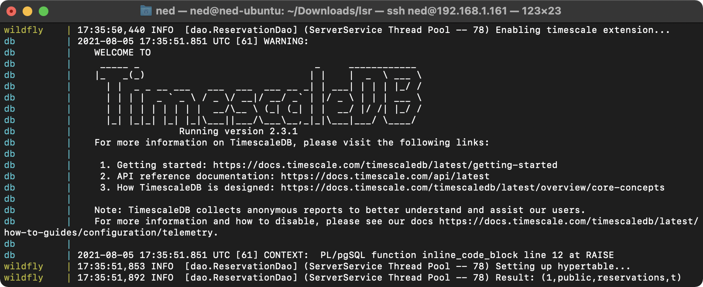

## Introduction
In this post I will show you how to create a Wildfly docker image with full support for the popular time-series database [TimescaleDB](https://www.timescale.com), and how to easily combine the two using Docker Compose.

## Wildfly docker image

As a base image, we'll use the latest [official Wildfly docker image](https://hub.docker.com/r/jboss/wildfly), named `jboss/wildfly:24.0.0.Final`.
Since TimescaleDB relies on PostgreSQL, we also need to setup the PostgreSQL driver and datasource in Wildfly. This requires the following:

-   Download PostgreSQL driver from the [official maven repository](https://mvnrepository.com/artifact/org.postgresql/postgresql)
-   Adding PostgreSQL module
-   Adding PostgreSQL driver
-   Setup a main Datasource

Luckily, all these steps can be automated using jboss cli (located at `/opt/jboss/wildfly/bin/jboss-cli.sh`).

Here's the full `Dockerfile`:

```dockerfile
FROM jboss/wildfly:24.0.0.Final

ENV WILDFLY_USER admin
ENV WILDFLY_PASS password
ENV JBOSS_CLI /opt/jboss/wildfly/bin/jboss-cli.sh
ENV DEPLOYMENT_DIR /opt/jboss/wildfly/standalone/deployments/

ENV DB_NAME sample-db
ENV DB_USER postgres
ENV DB_PASS postgres
ENV DB_HOST db
ENV DB_PORT 5432
ENV POSTGRESQL_VERSION 42.2.23

RUN echo "Building wildfly"
RUN echo "=> Adding administrator user"
RUN $JBOSS_HOME/bin/add-user.sh -u $WILDFLY_USER -p $WILDFLY_PASS --silent

RUN echo "=> Starting WildFly server" && \
      bash -c '$JBOSS_HOME/bin/standalone.sh &' && \
    echo "=> Waiting for the server to boot" && \
      bash -c 'until `$JBOSS_CLI -c ":read-attribute(name=server-state)" 2> /dev/null | grep -q running`; do echo `$JBOSS_CLI -c ":read-attribute(name=server-state)" 2> /dev/null`; sleep 1; done' && \
    echo "=> Downloading PostgreSQL driver" && \
      curl -k --location --output ./postgresql-${POSTGRESQL_VERSION}.jar --url https://repo1.maven.org/maven2/org/postgresql/postgresql/${POSTGRESQL_VERSION}/postgresql-${POSTGRESQL_VERSION}.jar && \
    echo "=> Adding PostgreSQL module" && \
      $JBOSS_CLI --connect --command="module add --name=org.postgresql --resources=./postgresql-${POSTGRESQL_VERSION}.jar --dependencies=javax.api,javax.transaction.api" && \
    echo "=> Adding PostgreSQL driver" && \
      $JBOSS_CLI --connect --command="/subsystem=datasources/jdbc-driver=postgresql:add(driver-name=postgresql,driver-module-name=org.postgresql,driver-class-name=org.postgresql.Driver,driver-xa-datasource-class-name=org.postgresql.xa.PGXADataSource)" && \
    echo "=> Adding main Datasource" && \
      $JBOSS_CLI --connect --command="data-source add \
        --name=PostgresDS \
        --jndi-name=java:jboss/datasources/PostgresDS \
        --user-name=${DB_USER} \
        --password=${DB_PASS} \
        --driver-name=postgresql \
        --connection-url=jdbc:postgresql://${DB_HOST}:${DB_PORT}/${DB_NAME} \
        --use-ccm=false \
        --blocking-timeout-wait-millis=5000 \
        --enabled=true" && \
    echo "=> Shutting down WildFly and Cleaning up" && \
      $JBOSS_CLI --connect --command=":shutdown" && \
      rm -rf $JBOSS_HOME/standalone/configuration/standalone_xml_history/ $JBOSS_HOME/standalone/log/* && \
      rm -f ./*.jar

EXPOSE 8080 9990 5005

CMD ["/opt/jboss/wildfly/bin/standalone.sh", "-b", "0.0.0.0", "-bmanagement", "0.0.0.0", "--debug", "*:5005"]
```

The following ports are exposed:

-   `8080` for the application
-   `9990` for the admin console
-   `5005` for debugging

\\
Remember to specify the correct datasource in your project's `persistence.xml` file:

```xml
<persistence-unit name="...">
    <jta-data-source>java:jboss/datasources/PostgresDS</jta-data-source>
    ...
</persistence-unit>
```

## Docker Compose

For the docker-compose file, there are two services required:

-   The modified Wildfly image with Timescale support, as seen above
-   The Timescale instance

Both services are fully configurable through environment variables and are able to communicate using Docker's [bridge networks](https://docs.docker.com/network/bridge/). Here's the full `docker-compose.yml`:

```yaml
version: "2"

services:
  wildfly:
    container_name: "wildfly"
    build:
      context: .
      dockerfile: Dockerfile
    environment:
      - WILDFLY_USER=admin
      - WILDFLY_PASS=password
      - DB_NAME=sample-db
      - DB_USER=postgres
      - DB_PASS=postgres
      - DB_HOST=db
      - DB_PORT=5432
    depends_on:
    - db
    volumes: 
    - ./workdir/deploy/wildfly/:/opt/jboss/wildfly/standalone/deployments/:rw
    ports:
      - "8080:8080"
      - "9990:9990"
      - "5005:5005"

  db:
    container_name: "db"
    image: "timescale/timescaledb:latest-pg13"
    environment:
      - POSTGRES_DB=sample-db
      - POSTGRES_USER=postgres
      - POSTGRES_PASSWORD=postgres
    volumes:
      - ./workdir/db/init/:/docker-entrypoint-initdb.d/
      - ./workdir/db/data/:/var/lib/postgresql/
    ports:
      - "5432:5432"
    
networks:
    default:
        driver: bridge
```

Note that:

-   Wildfly image is automatically fetched from the `Dockerfile`, which should be in the same folder as the `docker-compose.yml`
-   Thanks to docker's volume mapping, you can add `.war` files in the `workdir/deploy/wildfly` and they will be deployed to Wildfly automatically
-   Database data is persisted in the `workdir/db` folder even when the container is destroyed. However, remember to set `hibernate.hbm2ddl.auto` property to `update` in your `persistence.xml` file, in order to avoid losing your data between launches.

To start the services, simply run `docker-compose up` from any terminal instance.

## Enabling TimescaleDB Hypertables in Java

First, create a class named `CustomPostgreSQLDialect` that extends `PostgreSQL95Dialect` and registers the `OTHER` sql type as a `String`:

```java
import org.hibernate.dialect.PostgreSQL95Dialect;
import java.sql.Types;

public class CustomPostgreSQLDialect extends PostgreSQL95Dialect {
    public CustomPostgreSQLDialect() {
        super();
        registerHibernateType(Types.OTHER, String.class.getName());
    }
}
```

This is required since Timescale's [create_hypertable](https://docs.timescale.com/api/latest/hypertable/create_hypertable/) return value is not natively supported by Hibernate. If you skip this step, you'll most likely end up with an error such as:

```no-highlight
javax.persistence.PersistenceException: org.hibernate.MappingException: No Dialect mapping for JDBC type: 1111
```

Then, specify `CustomPostgreSQLDialect` as the Hibernate dialect in your project's `persistence.xml` file:

```xml
<persistence-unit name="...">
    <properties>
        ...
        <property name="hibernate.dialect" value="CustomPostgreSQLDialect"/>
        ...
    </properties>
</persistence-unit>
```

Finally, enable TimescaleDB extension on the database and then create the hypertable:

```java
// Enable TimescaleDB extension
entityManager.createNativeQuery("CREATE EXTENSION IF NOT EXISTS timescaledb;").executeUpdate();

// Create hypertable
String result = entityManager.createNativeQuery(
        "SELECT create_hypertable('YOUR_TABLE_HERE', 'YOUR_TIME_COLUMN_HERE')"
).getSingleResult().toString();

LOGGER.info(String.format("Result: %s", result));
```

If all went well, you should see something like this in the logs:

```no-highlight
Result: (1,public,YOUR_TABLE_HERE,t)
```



For more details on hypertables refer to the [offical TimescaleDB documentation](https://docs.timescale.com/timescaledb/latest/getting-started/).

## References

- [TimescaleDB](https://www.timescale.com)
- [Docker-Test_DevEnv project](https://github.com/BrizziB/Docker-Test_DevEnv) by BrizziB
- [Creating a Wildfly Docker image with PostgreSQL](https://blog.mikesir87.io/2015/12/creating-wildfly-docker-image-with-postgresql/) by mikesir87
